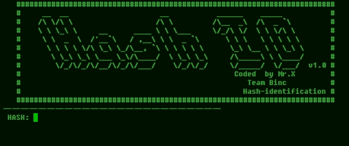

# Hash-identification


## introduction
This is a tool for identifying hash keys so they can be encrypted according to their type

## Instalations
```
$ apt update
$ apt upgrade 
$ pkg install python
$ pkg install python3
$ pkg install git
$ git clone https://github.com/Whomrx666/hash-id
$ cd hash-id
$ python hash-id.py
```
## You can execute with this command
```
$ python3 hash-id.py (The script)
```
## Example


## Instructions
- **One**: First, enter the script locked by the hash into the tool
- **Two**: Then the tool will automatically identify what keys are used in the script 
- **Done**: And you will be able to see what type of key the script uses 

## Observation
This is a tool for education only, I am not responsible for any misuse
### Original Author
<a href="https://github.com/Whomrx666"></a>

Follow me: [Whatsapp](https://wa.me/6287855190571),[Youtube](https://youtube.com/@whomrx666),[Tiktok](https://www.tiktok.com/@whomr.x),[Facebook](https://www.facebook.com/whomrx.666),[Telegram](https://t.me/@Whomr_X),&[Website](https://whomrxhackers.blogspot.com/)

**If you want to donate, click on the button**
<a href="https://saweria.co/whomrx"></a>

