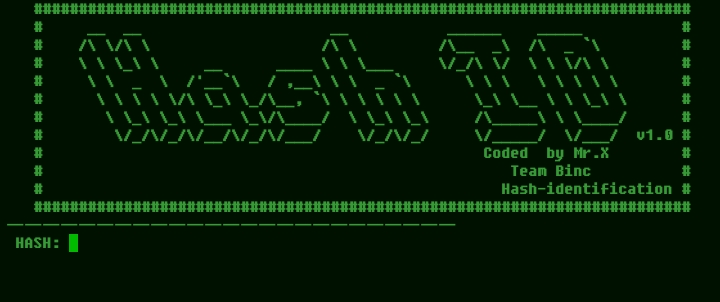

# Hash-identification


## introduction
This is a tool for identifying hash keys so they can be encrypted according to their type

## Instalations
```
$ apt update
$ apt upgrade 
$ pkg install python
$ pkg install python3
$ pkg install git
$ git clone https://github.com/Whomrx666/hash-id
$ cd hash-id
$ python hash-id.py
```
## You can execute with this command
```
$ python3 hash-id.py (The script)
```
## Example


## Instructions
- **One**: First, enter the script locked by the hash into the tool
- **Two**: Then the tool will automatically identify what keys are used in the script 
- **Done**: And you will be able to see what type of key the script uses 

## Observation
This is a tool for education only, I am not responsible for any misuse
### Original Author
<a href="https://github.com/Whomrx666"></a>

## CONNECT WITH ME :

[](https://whomrxhackers.blogspot.com/)
[](https://twitter.com/whomrx666)
[](https://wa.me/6285926601133?text=Halo%2C%20Mr.X)
[](https://www.facebook.com/whomrx.666)
[](https://t.me/Whomr_X)
[](mailto:whomrx666@gmail.com)
[](https://www.tiktok.com/@whomr.x)

**If you want to donate, click on the button**
<a href="https://saweria.co/whomrx"></a>

---

<p align="left">
  
</p>

---
